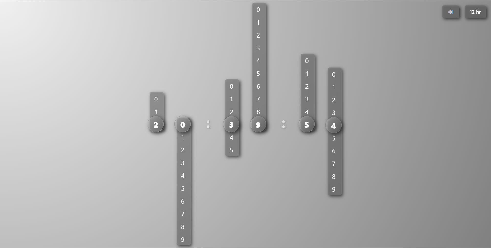
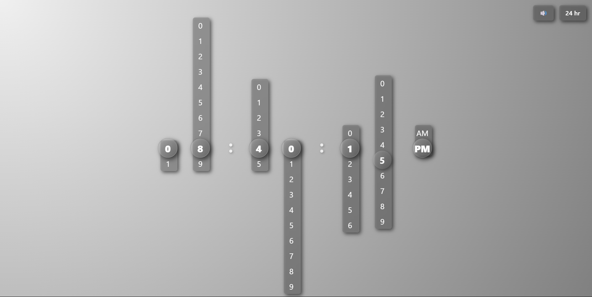

# 🕒 Glassy Clock Slider UI

A beautiful animated clock interface built with **React** and **Tailwind CSS**. The clock displays time using vertical sliders for each digit with real-time updates, optional tick sound, and both **12-hour** and **24-hour** formats. The layout is responsive on different screen sizes.

---

### 📷 Clock Format Previews

  
  &nbsp; &nbsp;
  

---

## ✨ Features

- ⏰ Real-time animated **vertical sliders** for clock digits  
- 🔊 Toggle **tick sound** ON/OFF  
- 🌓 Switch between **12-hour** and **24-hour** formats  
- 📱 **Responsive design**
- 💅 Sleek **glassmorphism UI** using Tailwind custom shadows and blur effects

---

## 🚀 Live Demo

[> Visit](https://digi-clock-m6390udpo-kapil-handeriyas-projects.vercel.app/)

---

## 🛠 Tech Stack

- ⚛️ React.js  
- 🎨 Tailwind CSS  
- 🔊 Audio (MP3) integration  
- 🌀 Smooth animations & transitions  

---

